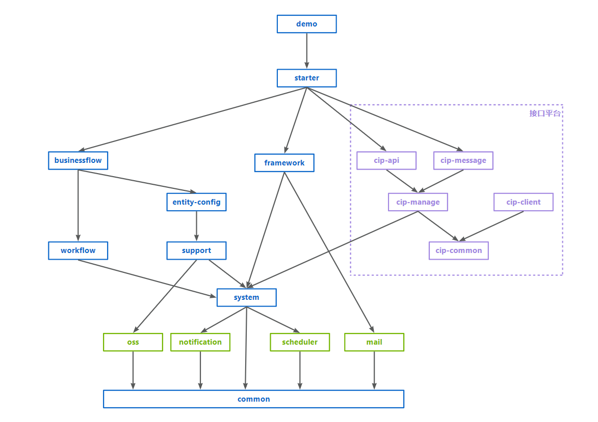

### 系统简介

企业级通用开发平台，前后端分离架构，单工程，多模块，部署形态为单体应用。
前端基于vue3.2.47，element-plus 2.1.0，前端框架vue-element-plus-admin1.9.4深度整合改造。
后端SSM+MybatisPlus，使用SpringBoot 2.3.0。
数据库使用MySql 8.0.

重度使用MybatisPlus，包括主键策略、逻辑删除、乐观锁、自动填充、数据分页、CURD接口、条件构造器等，
二次封装和扩展代码生成器，实现entity、dao、service、controller、vo及前端vue页面生成。

整体架构图如下：

技术选型，详见专栏博客：https://blog.csdn.net/seawaving/article/details/130015830

### 后端架构

到目前为止，整个工程项目，后端共计19个模块，架构图和依赖关系如下图所示：

模块分成三类，一类是平台内核模块，命名规则是platform+模块功能名称，图中用蓝色标示；一类是能力扩展模块，命名规则是platform-boot-starter+模块功能名称，图中用绿色标示；剩下的一类是接口平台，命名规则是cip
+模块功能名称，图中用紫色标示，相对平台独立，但又作为平台的重要组成部分。

#### 平台内核模块

platform-common作为公用基础模块，主要包括工具类、公用注解、公共父类、公共常量、公共枚举值，与前端UI交互定义的vo类，该模块为最基础的模块，无前置依赖。

platform-system是平台最核心的模块，主要包括组织机构、人员、角色（用户组）、权限、日志、系统参数、模块这些实体和服务的实现，需要注意的是，权限控制、日志记录，并不是在该模块实现，而是在platform-framework平台框架中实现，该模块依赖于platform-common。

platform-framework是平台框架，负责身份认证、权限控制、全局配置、数据分页、日志处理、自动填充（创建人、创建时间、修改人、修改时间），因为身份认证、权限控制等功能，不可避免需要使用处于platform-system模块中的人员、用户组等实体和服务，因此依赖于platform-system。

platform-support是一个业务支撑模块，基于技术组件进行功能设计与封装，实现一些通用的功能设计，更方便业务逻辑的实现，提供附件管理、通知公告、内容模板（用于短信、邮件、消息）、单据流水号、门户等功能。这些支撑模块同样需要位于platform-system模块中的人员、组织机构等实体和服务，因此依赖于platform-system。

platform-entityconfig属于低代码配置范畴，定义了业务实体的元数据，通过模块、实体、模型、视图多级配置，结合模板技术，实现细粒度的代码生成控制。

platform-workflow集成了工作流组件activiti的分支Camunda，实现了流程建模、流程模板，以及我的待办、我的已办和我的申请等功能。

platform-businessflow是业务流程的集中存储模块，实现了流程导航功能和请求申请示例流程。

platform-boot-starter是平台启动项目，整合平台基础功能，类似于spring-boot-starter，业务系统引入该包进行依赖。该模块自身没有实体与服务，而是汇总整合，把platform-framework
引用进来，同时进行配置。配置分两方面，一方面是做一个配置类，加一些注解（如：@EnableRetry、@ServletComponentScan、@EnableTransactionManagement），使用开发平台实现的业务系统，就不需要在启动类上重复添加这些注解；另一方面，是位于yml配置文件中的配置信息，也分为两部分，一部分是三方组件自身的，如数据源、连接池、redis、quartz、logback，另一方面是自定义的系统参数，如用户默认密码、导出excel数据的批次最大行数量。

platform-boot-starter-demo是示例项目，实际是模拟业务系统如何使用开发平台，用于平台自身功能开发与调试。

#### 能力扩展模块

绿色标示的五个模块，比较好理解，通常是对第三方组件的封装与整合，依赖于公共基础模块platform-common，这些模块可以不断扩展的，业务系统按需引入即可，这样就实现了核心模块必选、扩展模块可选的目的。

* platform-boot-starter-mail：邮件，集成springmail组件，实现邮件的发送功能封装
* platform-boot-starter-oss： 对象存储，用于文件存储封装，底层可基于多种模式，如本地磁盘、对象存储系统等
* platform-boot-starter-scheduler：任务调度，集成quartz组件，实现任务调度可视化配置
* platform-boot-starter-notification：消息通知，基于netty实现的websocket，用于系统内置消息
* platform-boot-starter-elasticsearch：全文搜索，集成elasticsearch组件
  对于扩展模块，平台的核心模块实际也可能会用到，例如platform-support中的附件功能，就会用到platform-boot-starter-oss；platform-system中的自动解锁用户功能，就会用到platform-boot-starter-scheduler。

#### 接口平台

将自己之前开源的通用接口平台进行了改造，将其作为一个模块，整合到应用开发平台当中来，由接口平台统一对外暴露应用系统的API数据接口以及推送事件消息。
platform-cip-common：公共基础
platform-cip-api：对外提供API数据接口，提供API服务
platform-cip-message：基于netty的web socket服务端提供消息服务
platform-cip-manage：平台自身基础数据的维护，如应用、API服务、消息服务、数据权限管理等。
4个模块内关系为manage依赖common，api和message相互独立，但都依赖于manage。

### 如何运行

以下为简要说明，详细的开发环境搭建手册参见https://blog.csdn.net/seawaving/article/details/134895546

#### 1. 准备工作

预装redis、nodejs、mysql、ide

#### 2. 初始化数据库

执行/resource目录下的init.sql,创建名字为abc的数据库。

#### 3 .前端

nodejs >=14.6

执行npm install pnpm -g，安装pnpm包

执行pnpm install命令，若nodejs版本过低会提示

使用vscode打开platform-web目录，执行pnpm install安装npm module

执行结束会提示如下错误，不用理会，因为把husky移除导致的，不影响系统正常运行，进行下步dev脚本即可
husky install
'husky' 不是内部或外部命令，也不是可运行的程序
或批处理文件。

执行dev脚本，默认打开localhost:4000

默认管理员账号密码：admin/12345678

#### 4 .后端

标准SpringBoot项目，多模块，启动类位于platform-boot-starter-demo下，默认端口8080。

注：系统的下拉数据源，也即数据字典使用redis缓存，按上述步骤构建后，部分查询界面不显示中文名称，可在系统登录后，访问系统管理-》系统维护菜单下的“重建缓存”按钮，系统会自动将数据库的字典数据写入到redis中。

#### 5 .接口平台对接客户端

cip-client是一个模拟的接口平台客户端，是一个独立的springboot，相当于第三方系统，有自己独立的数据库，数据库脚本参见\cip-client\src\main\resources\init.sql

#### 6 .minio启用说明

平台对于文件存储除了支持本地磁盘模式外，还实现了minio对象存储组件的集成。如需启用，需安装minio服务端，版本2021-04-22T15-44-28Z（最后一个基于apache
2.0开源协议的版本)，并修改平台配置文件。

### 平台文档

平台文档是平台的重要组成部分，这块容易被忽视或不被重视。即使一个平台或系统架构优秀、设计合理、代码优雅，但文档缺失，对于平台的使用方而言，熟悉成本高、难度大。不可避免存在疑问，需要动手尝试验证或翻看源码才能确定系统的实际处理逻辑，效率低下。

此外，有些平台或系统虽然有文档，但文档流于形式化，为了写文档而写文档的产物。这样的文档质量堪忧，常见的问题主要有两个：
1.形式化与套路化，把功能模块和实体一列，然后增删改查，放几张截图，实际上都是些正确而无用的套话，提供的价值非常有限。
2.文档与系统实现不符，没有随系统重构或优化同步调整，这种实际危害更大，容易产生误导。

个人认为，文档应该站在使用者角度去编写，除了把属性和功能说清楚说完整，更重要的是把注意事项、最佳实践表达出来。在描述过程中，也应该提下为什么这么设计，有什么优点，以及有什么局限。

这样的文档，才能发挥自身的作用，给使用者必要的指引，让使用者快速了解与入门，遵循平台的设计，合理使用平台，追求最佳实践，发挥平台价值。

#### 系统管理模块使用手册

对于应用开发平台的核心基石——系统管理模块，我精心撰写了一份详尽的说明手册。该手册旨在从使用者的角度出发，不仅全面阐述系统的各项属性和功能，更着重强调使用过程中的注意事项和最佳实践。

在手册的编写过程中，我特别注重解释每个设计背后的原因，以及这些设计所带来的优点和可能存在的局限。这样做的目的是为了让使用者能够更深入地理解平台的设计理念，从而更快地掌握使用方法，遵循平台的设计原则，并充分发挥平台的潜力。
参见[https://blog.csdn.net/seawaving/category_12522469.html](https://blog.csdn.net/seawaving/category_12522469.html)

#### 应用开发示例

为了更直观地展示如何基于平台进行业务应用开发，以一个真实的业务系统为例进行详细说明。在这个过程中，将涵盖从新增前后端功能模块，到通过低代码配置实体、模型、视图，再到生成库表和代码的全过程。此外，还将讨论如何配置权限和菜单，以及如何使用数据字典等辅助功能。

值得一提的是，在平台生成的代码基础上，将指导使用者如何进行前端界面的调整和后端业务逻辑的实现。这将有助于使用者更好地发挥平台的灵活性，根据实际需求进行定制化的开发。

通过这份手册的指引，我相信使用者将能够快速上手应用开发平台，充分利用平台提供的各项功能，实现高效、稳定的业务应用开发。同时，遵循最佳实践也将有助于发挥平台的最大价值，提升整体的开发效率和质量。

参见[https://blog.csdn.net/seawaving/category_12695928.html](https://blog.csdn.net/seawaving/category_12695928.html)

### 常见问题

**系统启动或运行时报错，某些库表不存在**

出现该情况主要是MySQL数据库是在Linux上部署，而Linux下MySQL数据库的默认配置是对库表名称大小写敏感。
报错的几张库表是通常是以act_和qrtz_起始，是工作流组件Camunda和任务调度Quartz使用的库表，本平台的数据库初始化脚本库表名都是小写，但Camunda和Quartz的代码中有些SQL语句使用大写表名去检索或处理数据，从而引发了问题。
建议：在Linux下配置MySQL数据库，将变量lower_case_table_names设置为1，这样MySQL数据库就不再区分大小写了，从而避免该问题。
请注意，该操作需要在MySql安装后首次运行前进行，否则需要重新安装MySQL数据库。

### 未来规划

客观地说，目前开发平台已经实现了大部分常用常见功能，可以投入使用了。
由于是一路狂奔模式，速度提升，时间缩短，但不可避免一些功能遗留了待办项，以及未充分测试导致存在bug，后面需要再循着功能过一遍，进行重构、测试，完善功能，输出设计。特别是低代码配置部分，需要持续完善与改进，简化配置，进一步提升开发效率。

后面几块是平台欠缺的，需要补全和完善，每一块都是硬骨头，难度和工作量都不小，大多数已完成，进展具体如下：

输出系统使用手册（已完成）

集成图表组件（已完成）

集成工作流（常用功能已完成，进度80%，已可用）

实现可视化表单（常用功能已完成，进度90%，待打磨）

移动端实现（整合了一个移动端框架，打通了认证，尚未有具体的功能，暂挂起）

实现数据权限（已完成）

自定义查询（已完成）

### 基于平台开发的应用

#### 文档管理系统

文档管理系统是基于平台实现的文档库管理应用，可作为企业内部文档库、知识库使用，主要包括以下功能：

* 文件夹管理：创建、更名、删除、复制、移动、授权；
* 文档管理：上传、下载、更名、复制、移动、预览、分享；
* 权限控制：按组织机构和按用户组两种授权模式；
* 在线预览：无需下载，上百种格式文件在线预览；
* 收藏夹：支持将文件夹和文档加入收藏、查看和移除；
* 全文搜索：对文本类、office文档和pdf文档等进行全文搜索；

### 系统设计资料

参见csdn博客专栏 [https://blog.csdn.net/seawaving/category_12590487.html](https://blog.csdn.net/seawaving/category_12590487.html)
平台研发过程中的设计思路、遇到的问题和方案的选择等一并分享出来，欢迎交流与讨论。

