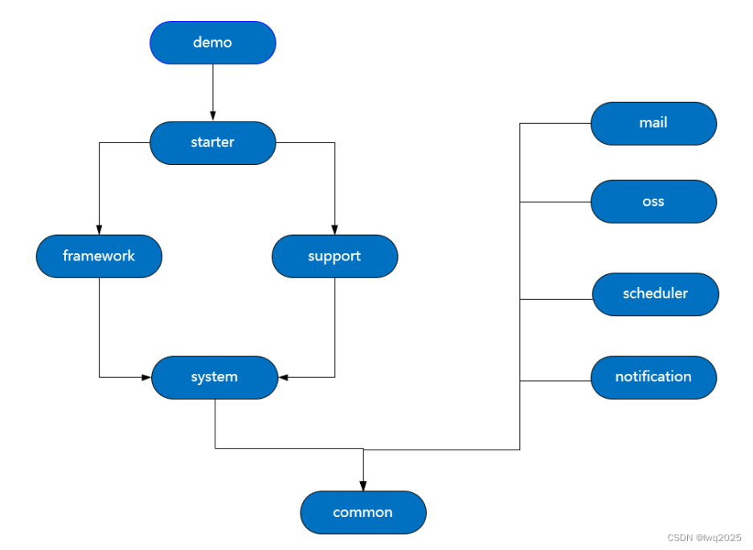

### 系统简介

企业级通用开发平台，前后端分离架构，单工程，多模块，部署形态为单体应用。
前端基于vue3.2.47，element-plus 2.1.0，前端框架vue-element-plus-admin深度整合改造。
后端SSM+MybatisPlus，使用SpringBoot 2.3.0。
数据库使用MySql 5.7.36.

重度使用MybatisPlus，包括主键策略、逻辑删除、乐观锁、自动填充、数据分页、CURD接口、条件构造器等，
二次封装和扩展代码生成器，实现entity、dao、service、controller、vo及前端vue页面生成。

整体架构图如下：

技术选型，详见专栏博客：https://blog.csdn.net/seawaving/article/details/130015830

### 后端架构

首先分成两部分，一部分是平台内核模块，命名规则是platform+模块功能名称；另一部分是能力扩展模块，命名规则是platform-boot-starter+模块功能名称。

platform-common作为公用基础，主要包括工具类、公用注解、公共父类、公共常量、公共枚举值，与前端UI交互定义的vo类，该模块为最基础的模块，无前置依赖。

platform-system是平台最核心的模块，主要包括组织机构、人员、角色、权限、日志、系统参数这些实体和服务的实现，需要注意的是，权限控制、日志记录，并不是在该模块实现，而是在platform-framework平台框架中实现，该模块依赖于platform-common。

platform-framework是平台框架，负责身份认证、权限控制、全局配置、数据分页、日志处理、自动填充（创建人、创建时间、修改人、修改时间），因为身份认证、权限控制等功能，不可避免需要使用处于platform-system模块中的人员、角色等实体和服务，因此依赖于platform-system。

platform-support是一个业务支撑模块，基于技术组件进行功能设计与封装，实现一些通用的功能设计，更方便业务逻辑的实现，提供附件管理、内容模板（用于短信、邮件、消息）、通讯组、单据流水号、门户等功能。这些支撑模块同样需要位于platform-system模块中的人员、组织机构等实体和服务，因此依赖于platform-system。

platform-boot-starter：平台启动项目，整合平台基础功能，类似于spring-boot-starter，业务系统引入该包进行依赖。该模块自身没有实体与服务，而是汇总整合，把platform-framework引用进来，同时进行配置。配置分两方面，一方面是做一个配置类，加一些注解（如：@EnableRetry、@ServletComponentScan、@EnableTransactionManagement），使用开发平台实现的业务系统，就不需要在启动类上重复添加这些注解；另一方面，是位于yml配置文件中的配置信息，也分为两部分，一部分是三方组件自身的，如数据源、连接池、redis、quartz、logback，另一方面是自定义的系统参数，如用户默认密码、导出excel数据的批次最大行数量。

platform-boot-starter-demo：示例项目，实际是模拟业务系统如何使用开发平台，用于平台自身功能开发与调试。

右侧四个模块，比较好理解，通常是对第三方组件的封装与整合，依赖于公共基础模块platform-common，这些模块可以不断扩展的，业务系统按需引入即可，这样就实现了核心模块必选、扩展模块可选的目的。
platform-boot-starter-mail：邮件
platform-boot-starter-oss： 对象存储
platform-boot-starter-scheduler：任务调度
platform-boot-starter-notification：消息通知
对于扩展模块，平台的核心模块实际也可能会用到，例如platform-support中的附件功能，就会用到platform-boot-starter-oss；platform-system中的自动解锁用户功能，就会用到platform-boot-starter-scheduler。

详见专栏博文：https://blog.csdn.net/seawaving/article/details/129425316

### 如何运行

#### 1. 准备工作

预装redis、nodejs、mysql、ide

#### 2. 初始化数据库

执行/resource目录下的init.sql,创建名字为abc的数据库。

#### 3 .前端

nodejs 18.14.2（未测试版本兼容性，理论上更高版本可用，低版本可能兼容）
使用vscode打开platform-web目录，执行pnpm install安装npm module
执行dev脚本，默认打开localhost:4000

#### 4 .后端

标准SpringBoot项目，多模块，启动类位于platform-boot-starter-demo下，默认端口8080。

注：系统的下拉数据源，也即数据字典使用redis缓存，按上述步骤构建后，部分查询界面不显示中文名称，可在系统登录后，访问系统管理-》系统维护菜单下的“重建缓存”按钮，系统会自动将数据库的字典数据写入到redis中。

#### 5 .接口平台对接客户端

cip-client是一个模拟的接口平台客户端，是一个独立的springboot，相当于第三方系统，有自己独立的数据库，数据库脚本参见\cip-client\src\main\resources\init.sql

### 整体计划

1.实现系统内核，打通前后端，系统能运转起来
2.实现低代码配置功能，这是后续开发的孵化器
3.基于低代码配置+高代码辅助实现系统管理模块
4.整合SpringSecurity框架，实现身份认证与权限控制
5.迁移自己已实现的通用接口平台,作为开发平台的一部分
6.集成功能组件，扩展技术能力,如quartz、mail、oss、echarts
7.基于技术组件封装业务功能组件
8.实现移动端接入
9.整合工作流

**当前进度：
第1项系统内核已完成
第2项完成60%，低代码配置功能可用，后续细节持续完善。
第3项已完成，基于低代码配置功能实现。
第4项已完成。
第5项已完成，基于低代码配置功能实现。**

### 系统设计资料

参见csdn博客专栏 [http://t.csdn.cn/Zug2R](http://t.csdn.cn/Zug2R)
平台研发过程中的设计思路、遇到的问题和方案的选择等一并分享出来，欢迎交流与讨论。

